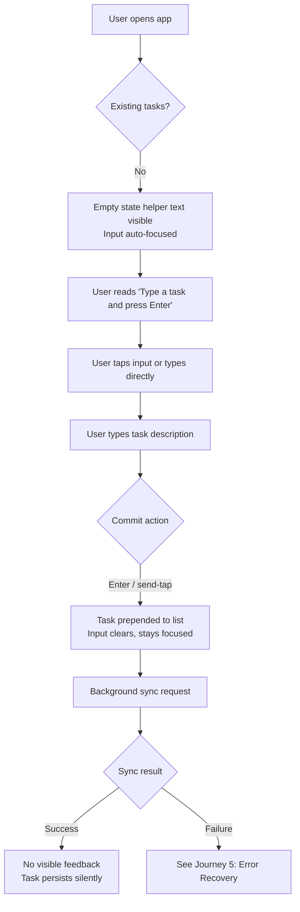
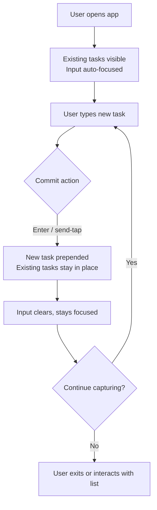
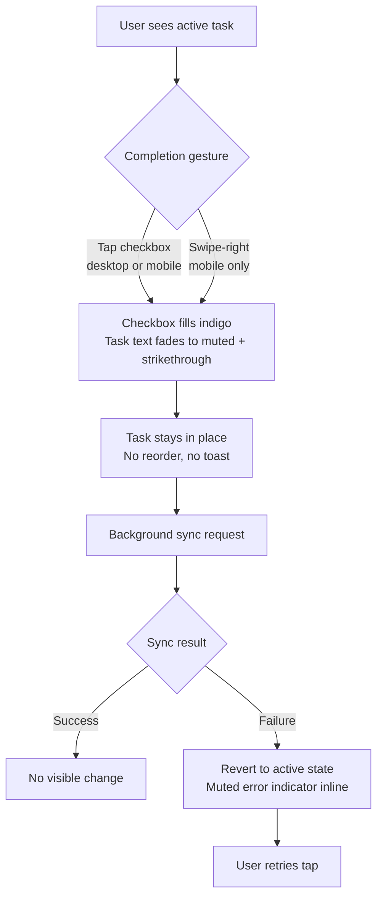
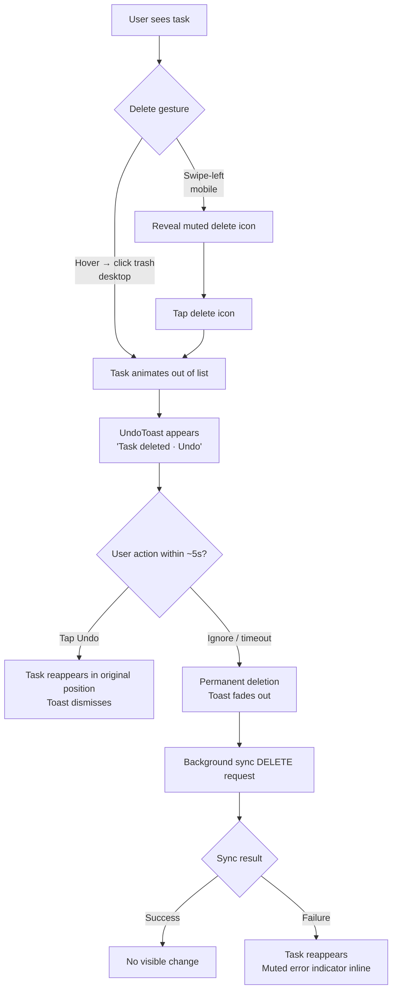
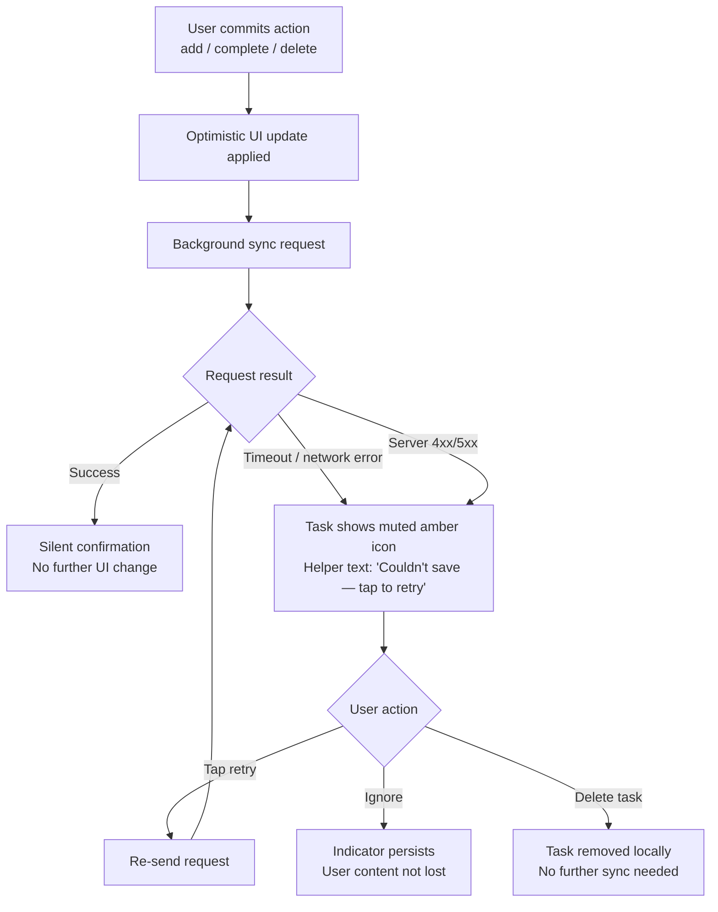

# UX Design Specification bmad-todo-app

**Author:** Mattiazaffalon
**Date:** 2026-04-19

---

## Executive Summary

### Project Vision

A deliberately minimal, mobile-first todo app for anyone with tasks to manage — no accounts, no priorities, no deadlines. The product differentiator is speed: capture, complete, and clear tasks faster than any comparable app. Every interaction must feel instantaneous.

### Target Users

Universal — anyone who has tasks, regardless of profession or technical skill. No specific persona; the product assumes only that the user can read and tap. Primary usage context is mobile, likely one-handed, in brief moments throughout the day.

### Key Design Challenges

- **Instant feel, end to end.** Optimistic updates are required; any visible latency on add/complete breaks the speed promise.
- **Thumb-zone ergonomics.** Primary actions (add, complete, delete) must be reachable one-handed on mobile.
- **Self-teaching interface.** No onboarding means the first screen must make the core loop (add → complete → delete) obvious within seconds.
- **Neutral, universal UI language.** No jargon, no culturally specific icons, no assumed workflow.

### Design Opportunities

- **Capture-first layout.** Treat the add-task input as the hero element — always visible, always ready.
- **Swipe gestures for completion and deletion.** Faster than checkboxes or menus on mobile, with clear visual affordance.
- **Progressive fade for completed tasks.** Reinforces a sense of progress without visual clutter, and keeps completed items available for reference without competing for attention.

## Core User Experience

### Defining Experience

The product's center of gravity is **task capture**. The moment a user thinks "I need to do X" and taps the app, they must be able to get that task saved in under two seconds, one-handed, without hunting for an input or dismissing a modal. Completing and deleting tasks are frequent secondary actions — fast and forgiving, but not the hero moment. If capture is frictionless, the product delivers on its speed promise.

### Platform Strategy

- **Primary surface:** Mobile web, responsive, touch-first, designed for one-handed use.
- **Secondary surface:** Desktop web, keyboard-accessible (Enter to add, keyboard shortcuts welcome for power users).
- **Offline / resilient behavior:** Deferred from v1. The app assumes a working connection; graceful error states cover brief failures, but full offline support is a future iteration.
- **No native apps in v1.** A responsive web app is sufficient and keeps deployment simple.

### Effortless Interactions

- **Adding a task:** Input is always visible and reachable in the thumb zone. No modal, no "save" button. Enter (desktop) or send-tap (mobile) commits instantly; input clears and is ready for the next task.
- **Completing a task:** Single tap on the task item (or swipe-right on mobile). Immediate visual feedback — fade plus strikethrough — with no loading state.
- **Deleting a task:** Swipe-left on mobile, quick action on desktop. Brief undo affordance (a few seconds) to forgive mistakes without requiring confirmation dialogs.
- **Optimistic updates everywhere:** The UI reflects the user's action immediately; network syncing happens in the background. Failures surface gently and never block the next interaction.

### Critical Success Moments

- **First 3 seconds after opening:** The user sees the input, the task list, and instantly understands the core loop — no onboarding needed.
- **First task captured:** Feels instantaneous. No confirmation friction, no "task added!" toast.
- **First task completed:** Visually satisfying — a quiet, rewarding transition that makes the user want to complete more.
- **Session continuity:** When reopened later, tasks are exactly where the user left them. No surprises, no re-login, no drift.

### Experience Principles

1. **Capture first, everything else second.** The input field is the product's center of gravity and always reachable.
2. **Optimistic by default.** Never make the user wait for the network to see their action reflected.
3. **Thumb-reachable.** Primary actions live in the lower half of the screen.
4. **Silent confidence.** No confirmations, no toasts for routine actions — the UI change *is* the confirmation.
5. **Forgive, don't prevent.** Allow undo rather than confirmation dialogs for destructive actions.

## Desired Emotional Response

### Primary Emotional Goals

The emotional tone of the product is **calm control with quiet satisfaction**. The app is not trying to delight, excite, or entertain — it aims to *get out of the user's way*. Success feels like "that was easy, I didn't even notice I used an app."

- **Relief** — "that thought is out of my head and into a safe place."
- **Control** — "my tasks are exactly where I expect them; nothing surprises me."
- **Momentum** — "completing one task makes me want to complete the next."

### Emotional Journey Mapping

- **First open:** Curiosity, possibly mild skepticism ("another todo app?"). Resolved within seconds by a clean, obvious interface that requires no explanation.
- **First capture:** A tiny moment of "oh, that was fast." Not joy — more like trust beginning to form.
- **Completing a task:** Subtle satisfaction. A quiet visual reward (fade + strikethrough) that reinforces progress without being performative.
- **Error or failure:** Calm, never alarming. Messages are matter-of-fact and suggest a next action; no red banners, no panic language.
- **Returning later:** Recognition and ease. Tasks are exactly where they were left. The app feels like a dependable tool, not a stranger.

### Micro-Emotions

Emotional states to prioritize:

- **Confidence** over confusion — no modals, no hidden actions, no ambiguous buttons.
- **Trust** over skepticism — data persists reliably; nothing feels fragile.
- **Satisfaction** over delight — quiet reward, not fireworks.
- **Accomplishment** over frustration — progress is visible; undo forgives mistakes.

Emotional states to actively avoid:

- **Anxiety** — no nagging, no overdue-red-flag shaming, no "you have 47 uncompleted tasks" counts.
- **Performative delight** — no confetti, no celebratory animations, no "Great job!" messages. The product respects the user's time, not their ego.
- **Overwhelm** — no density, no feature-discovery popups, no secondary navigation distractions.

### Design Implications

- **Calm → Restrained palette and typography.** Neutral colors, generous whitespace, no loud accents for routine states.
- **Control → Predictable layout.** The input stays in the same place. Tasks don't jump around unexpectedly. Sorting and grouping are stable.
- **Momentum → Quiet visual rewards.** Completion uses a gentle transition (fade + strike-through) that feels satisfying without interrupting flow.
- **Trust → Immediate, stable feedback.** Optimistic updates with graceful reconciliation on failure; no jarring reverts.
- **No performative delight → No gratuitous animation.** Motion serves function (state change, affordance) only.
- **No anxiety → Soft error handling.** Errors are neutral in tone, offer a clear retry, and never use alarming color or language.

### Emotional Design Principles

1. **Get out of the way.** The best emotion is the one the user doesn't notice, because the task is already done.
2. **Reward with quiet, not noise.** Completion should feel good without performing celebration.
3. **Never shame the user.** No counters, no nags, no red flags for incomplete tasks.
4. **Stability is an emotion.** Predictable layout and persistent state build trust over time.
5. **Forgiveness over prevention.** Undo, don't confirm. Users should never feel trapped by their own actions.

## UX Pattern Analysis & Inspiration

### Inspiring Products Analysis

Two products anchor our inspiration: **Apple Notes** and **Things 3**. Both exemplify the calm, fast, quietly satisfying experience we want to create.

**Apple Notes**

- **Zero-ceremony capture.** Open the app and the cursor is ready. No "create new note" button, no modal — the act of opening *is* the act of starting.
- **Invisible persistence.** Content saves automatically and silently. The user never thinks about saving; they just trust it works.
- **Restrained visual language.** Neutral typography, generous whitespace, no decorative flourish. The UI disappears and the content remains.
- **Forgiving by default.** Deleted items live in a recently-deleted bin; nothing feels irreversibly lost.

**Things 3**

- **Quiet delight in motion.** The "magic plus button" that floats and drags to position feels tactile and rewarding without being flashy.
- **Completion as subtle reward.** Checking off a task produces a gentle animation — satisfying, never performative.
- **Restrained information hierarchy.** Only what's needed is shown; everything else is one tap away and predictable.
- **Typographic calm.** Beautifully set type, consistent spacing, and a palette that recedes rather than competes for attention.
- **Predictable layout.** Tasks don't jump unexpectedly. Sorting and grouping feel stable and trustworthy.

### Transferable UX Patterns

**Capture patterns**

- **Always-ready input (from Apple Notes).** The add-task field is focused and reachable the moment the app opens. No "New task" button required.
- **Auto-save, no save button (from Apple Notes).** Commit on Enter / send-tap; no explicit save action anywhere.

**Interaction patterns**

- **Gentle completion animation (from Things 3).** A brief fade + strikethrough when a task is marked done — visual reward without celebration.
- **Swipe gestures with clear affordance (from Apple Notes' iOS conventions).** Swipe-left for delete, swipe-right for complete, with consistent color and iconography.
- **Undo via brief affordance (from Apple Notes' recently-deleted model, applied inline).** A short "Undo" toast after destructive actions rather than a confirmation dialog up front.

**Visual patterns**

- **Restrained palette (from both).** Neutral background, a single quiet accent color for completion state, no category coloring in v1.
- **Typographic hierarchy (from Things 3).** Size and weight do the work; decoration doesn't. One font family, two or three weights maximum.
- **Generous whitespace (from both).** Tasks breathe. List density is low by default.

### Anti-Patterns to Avoid

- **Feature-discovery popups and tooltips.** Conflicts with "the UI must self-teach." If it needs a tooltip, redesign it.
- **Modal dialogs for confirmation on routine destructive actions.** Use undo instead (inline toast), consistent with "forgive, don't prevent."
- **Overdue/red-flag visual alarms or uncompleted-task counters in the UI.** Conflicts with "never shame the user."
- **Celebratory animations, confetti, or "Great job!" copy.** Conflicts with "reward with quiet, not noise."
- **Cluttered secondary navigation (sidebars, tabs, drawers) in v1.** The app has one screen; don't invent navigation to fill space.
- **Bouncy, physics-heavy motion for decorative purposes.** Motion should serve function (state change, affordance), not performance.
- **Category colors, tags, or priority flags by default.** Out of PRD scope and conflicts with the restrained visual language.

### Design Inspiration Strategy

**What to adopt directly**

- **Always-ready capture input** (Apple Notes) — the input is focused and in the thumb zone on open.
- **Silent auto-commit** (Apple Notes) — Enter / send commits instantly; no save button anywhere.
- **Gentle completion animation** (Things 3) — fade + strikethrough, ~200–300ms, subtle easing.
- **Restrained typographic hierarchy** (Things 3) — one family, minimal weights, whitespace over dividers.

**What to adapt**

- **Swipe gestures for complete/delete** — adopt the iOS convention, but pair with an inline undo toast (not a recently-deleted bin, which is out of scope for v1).
- **Neutral palette with a single accent** — simpler than Things 3's refined palette; skip category colors and scheduling UI entirely.
- **Thumb-zone action placement** — Things 3's floating action paradigm adapted to a persistent bottom-anchored input on mobile, rather than a draggable button.

**What to avoid**

- **Things 3's scheduling/Areas/Projects hierarchy.** Out of PRD scope; would pull the product away from minimalism.
- **Apple Notes' richtext toolbar and formatting options.** Tasks are short plain text only in v1.
- **Any onboarding, feature walkthrough, or empty-state-with-illustrated-CTA pattern.** The empty state should teach by simplicity, not decoration.

## Design System Foundation

### Design System Choice

**shadcn/ui + Tailwind CSS + Radix primitives** on a React frontend.

- **shadcn/ui** for copy-owned, unopinionated components built on Radix.
- **Radix primitives** for accessible, keyboard-friendly interaction behavior (focus management, ARIA, screen-reader semantics).
- **Tailwind CSS** as the styling layer and design-token enforcement mechanism.

This is an unopinionated foundation with accessibility built in — no pre-imposed visual language to fight against, and a small surface area that matches the product's minimalism.

### Rationale for Selection

1. **Visual neutrality fits the brief.** The Apple Notes / Things 3 aesthetic is calm, restrained, and neutral. An opinionated system (Material Design, Ant Design) would bring baggage we'd spend effort undoing. shadcn components are ours to shape from the start.
2. **Accessibility is free.** Radix handles keyboard, focus, and ARIA correctly — essential for a universal audience that includes assistive-tech users.
3. **Minimal surface area matches minimal scope.** The v1 app needs only a handful of components (input, list item, icon button, toast). shadcn's copy-paste model means we pull in only what's used.
4. **Token enforcement via Tailwind.** A small, disciplined palette, type scale, and spacing system is trivially enforced through utility classes and `tailwind.config`.
5. **Team-neutral.** No proprietary component API — any developer comfortable with React and Tailwind can contribute without ramp-up.

### Implementation Approach

- **Component inventory (v1):** task input, task list item (with swipe affordance), icon button, undo toast, empty state, error state. That's the entire component set.
- **Design tokens (starting minimum):**
  - **Palette:** one neutral (background), one foreground (text), one muted foreground (secondary text), one subtle accent (completion state). No category colors, no semantic-warning red for normal states.
  - **Typography:** one sans-serif family (e.g., Inter or system font stack), two weights (regular, medium), 3–4 sizes maximum.
  - **Spacing:** 4–5 steps on a 4px base grid; generous vertical rhythm between tasks.
  - **Motion:** one short duration (~200ms) and one longer duration (~300ms), both with gentle easing. No bounce, no spring.
- **Icon set:** a single library (Lucide or Heroicons) — stroke-based, minimal, consistent weight.
- **Custom interaction layer:** swipe gestures and the inline undo toast will require lightweight custom logic (e.g., `react-swipeable` plus a small toast primitive). Scope is small and contained.

### Customization Strategy

- **Start minimal, expand only on demand.** The initial token set is intentionally tight. Do not introduce new tokens, weights, or colors unless a concrete component need forces it.
- **Own every component source.** Because shadcn components are copied into the repo rather than imported from an npm package, we can tune any component directly without version-pinning or override complexity.
- **Dark mode considered, deferred.** Tailwind makes dark mode mechanically easy, but it's not required for v1. Design tokens will be defined as CSS variables from the start so a future dark theme is a small change, not a rewrite.
- **No design-system "platform" build-out.** No Storybook, no token export pipelines, no published component library. v1 is a single app; treat the design system as *internal conventions*, not a separate product.

## Defining Core Experience

### Defining Experience

The defining interaction is **frictionless task capture**: the user opens the app, types, and their task is saved — thought-to-persisted in under two seconds, one-handed on mobile, without tapping any "save" or "add" button beyond the commit action itself. Every other interaction (complete, delete, undo) is secondary; if capture is perfect, the product delivers on its promise.

### User Mental Model

The user's mental model is closer to **sending a message** than **filling a form**. They don't think "I am creating a task entity" — they think "I'm getting this thought out of my head before I forget it." The UI must match that mental model:

- No "new task" wizard, no modal, no multi-field form.
- A single always-available input where typing *is* starting, and committing (Enter / send-tap) *is* saving.
- The just-captured task appears at the top of the list immediately — confirmation by visible result, not by confirmation message.
- Users currently solve this problem with Apple Notes, text messages to themselves, or sticky notes. Our interaction model should feel at least as fast and light as any of those.

### Success Criteria

The defining experience is successful when:

- **Time-to-saved is under two seconds** from opening the app to a new task committed, on mobile, one-handed.
- **The user never sees a loading spinner** on add, complete, or delete during normal operation. Updates appear instantly; sync happens in the background.
- **There is no "save" button.** Enter (desktop) or send-tap (mobile) is the only commit action.
- **The input is focused on open** and ready to receive input with zero additional taps.
- **The newly captured task appears at the top of the list immediately**, visible to the user as confirmation.
- **No toast, no "task added!" feedback.** The visible task IS the confirmation.

### Novel UX Patterns

This experience is built almost entirely from **established patterns**, combined with discipline:

- **Always-focused input on open** (Apple Notes convention).
- **Enter-to-commit** (messaging and search-bar convention).
- **Swipe gestures for complete/delete on mobile** (iOS Mail / Notes convention).
- **Inline undo toast** (Gmail-style undo affordance).
- **Optimistic update** (standard in modern reactive UIs).

No novel interaction requiring user education. The product's distinctiveness comes from *what we refuse to add* — no onboarding, no modal, no categories, no priority — not from inventing new patterns. Our "unique twist" is restraint: combining familiar patterns at a density far below competitor defaults.

### Experience Mechanics

**1. Initiation**

- User opens the app. The task list and the input are both visible immediately.
- **Mobile:** the input is anchored to the bottom of the screen in the thumb zone, auto-focused; the mobile keyboard rises automatically.
- **Desktop:** the input is anchored to the top of the list, auto-focused on page load; cursor ready.
- No "Create new task" button. No greeting, no modal, no prompt.

**2. Interaction**

- User types a short task description. Text appears live in the input, no character counter shown.
- A **soft limit of ~280 characters** is silently enforced — beyond it, further input is ignored without visible warning.
- Commit actions:
  - **Desktop:** pressing `Enter` commits the task.
  - **Mobile:** tapping the send-icon button (persistent, adjacent to the input) OR pressing the keyboard's Return/Done key commits the task.
- Upon commit, the task is immediately prepended to the top of the active list (optimistic update). The input clears and remains focused, ready for the next task.
- A network request is sent in the background. If it succeeds, nothing further happens visible-side. If it fails, see Feedback below.

**3. Feedback**

- **Success:** the visible, new task at the top of the list IS the feedback. No toast, no sound, no animation beyond the task appearing.
- **Input clears and stays focused**, signaling readiness for the next capture.
- **Failure (network or server error):** the task remains visible but is marked with a subtle, non-alarming indicator (muted icon + soft helper text like "Couldn't save — tap to retry"). The user's typed content is not lost, and the failure never blocks the next action.
- **Offline/transient error:** handled identically to server error in v1; full offline-first behavior is deferred.

**4. Completion**

- The user knows they're "done" capturing a task the moment the input clears and the task appears in the list — typically within ~100ms.
- The natural next action is either capturing another task (input is still focused) or completing/deleting an existing one (tap, or swipe on mobile).
- On completion of a task, the item fades and strikethroughs in place (no reordering; "stability is an emotion"). No congratulation, no toast.
- On deletion, an inline "Undo" toast appears briefly (~5 seconds) before the task is permanently removed.

**List ordering and layout**

- **Newest task appears first.** This matches the capture-oriented mental model.
- **Completed tasks stay in place**, faded and struck-through. They are not auto-moved to a "Completed" section.
- No drag-to-reorder, no grouping, no sections in v1.

**Empty state**

- When no tasks exist: the list area shows a single line of muted helper text — "Type a task and press Enter" (desktop) or "Tap the field to add your first task" (mobile) — positioned adjacent to the input. No illustration, no CTA button, no decorative element. The input itself is the affordance.

## Visual Design Foundation

### Color System

A deliberately minimal palette — three neutrals plus one muted accent. No semantic color overload; restraint over expressiveness.

**Tokens (light theme, v1):**

| Token | Value (hex) | Usage |
|---|---|---|
| `--bg` | `#FAFAFA` | Page background |
| `--surface` | `#FFFFFF` | Task card surface, input surface |
| `--foreground` | `#18181B` | Primary text, icons |
| `--foreground-muted` | `#71717A` | Secondary/helper text, completed task text |
| `--border-subtle` | `#E4E4E7` | Dividers, input border |
| `--accent` | `#4F46E5` | Single accent — completed checkmark, focused input ring, send button active state |
| `--accent-foreground` | `#FFFFFF` | Text on accent surfaces |
| `--error-foreground` | `#B45309` | Muted amber for error/retry states — never bright red |

**Principles:**

- **One accent only.** Indigo (`#4F46E5`) is used sparingly: the send button when input has content, the completion checkmark, and the input focus ring. It is not used for decoration or hover states.
- **No alarming red.** Error and retry states use a muted amber rather than pure red, consistent with "errors are never alarming" and "never shame the user."
- **Completed tasks use `--foreground-muted`** plus strikethrough. No green checkmark, no celebratory color.
- **Contrast:** `--foreground` on `--bg` is ~15:1 (WCAG AAA). `--accent` on `--accent-foreground` is ~4.8:1 (WCAG AA). `--foreground-muted` on `--bg` is ~4.6:1 (WCAG AA) — used only for secondary text.

**Dark mode:** all color tokens authored as CSS variables from day one. A full dark theme is deferred to post-v1, but the architecture supports a single-switch implementation later.

### Typography System

One family, two weights, four sizes — enforced discipline.

**Font family:** `Inter` (via self-hosted or system font provider), with a system-font fallback stack: `ui-sans-serif, -apple-system, system-ui, "Segoe UI", Roboto, sans-serif`.

**Weights:**

- **Regular (400)** — body, task text, helper text.
- **Medium (500)** — send button label, optional emphasis. No bold, no semibold in v1.

**Type scale:**

| Role | Size | Line height | Weight |
|---|---|---|---|
| Task text (body) | 16px (1rem) | 1.5 | 400 |
| Input text | 16px (1rem) | 1.5 | 400 |
| Helper / muted text | 14px (0.875rem) | 1.4 | 400 |
| Empty-state helper | 14px (0.875rem) | 1.4 | 400 |
| Send/action label (if text-labelled) | 14px (0.875rem) | 1.2 | 500 |

No H1/H2/H3 hierarchy in v1 — the app has no headings because it has no sections.

**Rationale:** 16px base for task and input text prevents mobile-browser zoom-on-focus (iOS Safari treats <16px inputs as zoomable). Inter is open-licensed, highly readable at all sizes, and emotionally neutral — it doesn't impose personality the way a serif or display face would.

### Spacing & Layout Foundation

**Base unit:** 4px grid. All spacing is a multiple of 4.

**Spacing tokens:**

| Token | Value | Usage |
|---|---|---|
| `--space-1` | 4px | Icon-to-label adjacency |
| `--space-2` | 8px | Compact internal padding |
| `--space-3` | 12px | Task list item vertical padding |
| `--space-4` | 16px | Input padding, screen margin |
| `--space-6` | 24px | Task list item horizontal padding, group gaps |
| `--space-8` | 32px | Section spacing (sparingly) |

**Layout principles:**

- **Single column.** No sidebars, no grid. The task list is a vertical column; maximum content width on desktop is ~640px, centered.
- **Generous vertical rhythm.** Task list items have 12px vertical padding minimum (~48px total height with touch targets in mind). No dividers between items — spacing and whitespace do the separation.
- **Touch targets ≥44×44px** per WCAG / Apple HIG. Send button, complete checkbox, and delete affordance all meet this minimum.
- **Mobile safe-area-aware.** The bottom-anchored input on mobile respects `env(safe-area-inset-bottom)` so it sits above the iOS home indicator and Android nav bar.
- **Input position is fixed.** On mobile, the input stays anchored to the bottom and never scrolls away. On desktop, the input stays anchored to the top of the container.
- **No full-width containers on desktop.** The ~640px maximum content width keeps line lengths readable and avoids a sparse, empty feel on wide monitors.

### Accessibility Considerations

- **WCAG 2.1 Level AA minimum** across all text and interactive elements. Primary text meets AAA.
- **Keyboard navigation:** full keyboard operability on desktop. Tab reaches the input first (already focused by default), then completion and delete controls on each task in list order. Focus states use the accent-color focus ring (2px outline, offset 2px).
- **Screen-reader semantics:** inherited from Radix primitives. The task list is announced as a list; each task is a list item with its completion state and action buttons properly labeled.
- **Motion respect:** `prefers-reduced-motion` honored — fade/strikethrough transitions become instant state changes when the user has reduced-motion enabled.
- **Text resizing:** the layout tolerates up to 200% browser zoom without horizontal scroll on mobile or desktop.
- **No reliance on color alone.** Completion state is conveyed by both color change (muted foreground) and strikethrough. Error state is conveyed by both a muted icon and helper text.
- **Touch targets ≥44×44px** on mobile as noted; complete and delete actions on a task row also meet this independently of visible icon size.
- **Input inherits device font-size settings** (no font-size locking), ensuring users with large-text accessibility preferences see the UI at their preferred scale.

## Design Direction Decision

### Design Directions Explored

Three focused directions were evaluated, constrained by the visual foundation (shadcn/Tailwind, single-column layout, indigo accent, Inter, 4px grid):

- **Direction A — Notes-Minimal.** Closest to Apple Notes. No dividers, no card edges; tasks are plain text on a generous whitespace canvas. Small circular checkbox as the completion affordance. Swipe-left for delete on mobile, hover-reveal trash icon on desktop.
- **Direction B — Things-Structured.** Closest to Things 3. Subtle surface cards (1px border or soft shadow) around each task. Rounded-square checkbox with a gentle fill animation. Swipe-left reveals a colored action panel on mobile. Moderate density.
- **Direction C — iOS-Conventional.** List-row style with full-width dividers, matching native iOS conventions. Full iOS swipe-to-delete pattern with red action color. Highest density of the three.

Wildly divergent "bold" alternatives were not explored because they would contradict the constraints locked in across the visual foundation and emotional-response steps.

### Chosen Direction

**Direction A — Notes-Minimal.**

Defining characteristics:

- **No dividers between tasks.** Vertical whitespace does the separation work.
- **No card edges or task-container shadows.** Tasks sit directly on the page background.
- **Completion affordance:** a small circular checkbox (empty = active, filled with indigo check = completed) on the left of each task, aligned with the task text baseline.
- **Deletion affordance:**
  - **Mobile:** swipe-left reveals a muted icon-only delete action. No full-width red wipe; the action panel uses neutral surface color with a muted amber icon.
  - **Desktop:** on hover, a subtle trash icon appears in a fixed position on the right of the task row; keyboard delete via a dedicated shortcut when a task is focused.
- **Density:** low. Task rows are ~48px tall with generous vertical padding; fewer tasks are visible per screen, but the list feels calm.
- **Typography weight:** task text in Inter Regular 400, 16px. No emphasis, no bold. Completed tasks shift to `--foreground-muted` with strikethrough, no additional styling.
- **Transitions:** 200ms fade + strikethrough on completion; no movement, no reordering. All motion respects `prefers-reduced-motion`.

### Design Rationale

- **Matches every articulated principle.** Restraint over decoration, whitespace over dividers, quiet reward over celebration, stability over motion. Direction A is the visual translation of "get out of the way."
- **Honors "never shame the user."** No red, no alarming color, no visual weight around overdue or uncompleted states. Direction C's iOS red swipe was the strongest reason to reject it despite its familiarity.
- **Honors "stability is an emotion."** No cards, dividers, or group boundaries that would shift or animate when the list changes. Tasks appear, fade, and disappear — the structure never rearranges.
- **Aligns with our primary inspiration (Apple Notes).** The capture-first mental model demands that the UI recede so the content — the user's tasks — is the only visible signal.
- **Accessibility-friendly.** Whitespace-driven separation is fully compatible with keyboard navigation, screen-reader semantics, and high zoom levels. No borders or shadows to distort at 200% zoom.

### Implementation Approach

- **Components to build** (shadcn-owned, copied into the repo):
  - `TaskInput` — auto-focused textarea-like input; Enter/send-tap commits; soft 280-char limit; bottom-anchored on mobile (safe-area-aware), top-anchored on desktop within the ~640px content column.
  - `TaskItem` — row with circular checkbox (left), task text (center, ellipsized at wrap), hover-reveal delete icon (right, desktop only). Swipe wrapper on mobile (via `react-swipeable` or similar).
  - `UndoToast` — short-lived inline toast component, anchored above the input on mobile, near the deleted row on desktop. Dismisses after ~5 seconds.
  - `EmptyState` — single line of muted helper text; no illustration, no CTA.
  - `ErrorIndicator` (per-task) — muted amber icon + helper text ("Couldn't save — tap to retry") inline with the task row.
- **Styling:** all tokens (color, spacing, type) consumed as Tailwind utility classes wired to CSS variables in `:root`, enabling a future dark-mode swap without code changes.
- **Motion:** Tailwind transition utilities (`transition-colors`, `duration-200`) for fade and strikethrough. Respect `prefers-reduced-motion` via media query at the token layer.
- **Gestures:** swipe-left on `TaskItem` via `react-swipeable` with a muted amber icon revealed. Threshold tuned so incidental horizontal scrolls don't trigger deletion. Pair every destructive swipe with an `UndoToast` — no confirmation dialog.
- **No design-system artifacts.** No Storybook, no published components; design decisions live in the application source and this document.

## User Journey Flows

### Journey 1: First-Time Capture

The user opens the app for the first time. No onboarding, no account, no greeting — just the interface.

**Success criteria:** user goes from app-open to first task saved in under 5 seconds, without tapping anything except the input and the commit action.

### Journey 2: Returning-User Capture

The user reopens the app with existing tasks. Their state is preserved; they capture another task.

**Success criteria:** zero-friction return. No re-authentication, no data fetch spinner visible to the user, no prompt.

### Journey 3: Complete a Task

The user marks a task done. Feedback is immediate, quiet, and stable.

**Success criteria:** completion feels instant and final. The user never doubts whether the action registered.

### Journey 4: Delete a Task with Undo

The user removes a task. Forgiveness over prevention: no confirmation dialog, short undo window.

**Success criteria:** accidental deletions are effortlessly recoverable; intentional deletions feel clean and irreversible after the toast window.

### Journey 5: Error Recovery (Failed Save)

A capture, completion, or deletion fails at the network/server layer. The app stays calm.

**Success criteria:** the user is never blocked, never loses typed content, and never sees an alarming modal or red banner. The failed state is informative but unobtrusive.

### Journey Patterns

Across all five flows, consistent patterns emerge:

**Navigation patterns**

- **Single-surface, no navigation.** The app has one screen. There are no back buttons, tabs, or drawers in any journey.
- **Input is always the anchor.** Every journey either starts at the input or returns focus to it after resolving.

**Decision patterns**

- **No confirmation dialogs.** Destructive actions (delete) use a post-action undo toast instead of a pre-action confirmation.
- **No user-facing branching on sync outcome.** Success is invisible; failure surfaces inline and non-alarmingly. The user is never asked to reconcile sync state.
- **Optimistic by default.** Every action updates the UI first, syncs second. The user's perceived flow never waits on the network.

**Feedback patterns**

- **Visible result IS the feedback.** Successful adds, completes, and deletes don't use toasts or "success" messages — the state change in the list is sufficient.
- **Failures use muted inline indicators, not interruptions.** Never a modal, never a red banner, never a blocking alert.
- **Destructive actions get a short undo toast.** This is the only interruption-style UI the app uses, and it's passive (auto-dismisses).

### Flow Optimization Principles

- **Minimize steps to value.** Every journey collapses to a single gesture where possible: capture = type + Enter; complete = one tap; delete = one swipe + optional undo.
- **Reduce cognitive load at decision points.** The user is never presented with a branching choice during a routine flow. The only decision in any journey is "do I want to undo?" — and the default (do nothing) is safe.
- **Clear feedback via state, not chrome.** Feedback lives in the content area (task appearing, fading, disappearing), not in overlay UI (toasts, banners, modals). Exception: undo toast and per-task error indicator.
- **Graceful error recovery.** Failures never lose user content and never block the next action. The user can always continue capturing while reconciling a prior failure.
- **Respect the stability principle.** No journey causes tasks to reorder, shift, or jump. Motion is local to the affected item only.

## Component Strategy

### Design System Components

Foundation components are provided by the shadcn/ui + Radix + Tailwind stack. The following are consumed directly (or copy-pasted from shadcn and lightly styled):

- **Input / Textarea** (Radix) — base for `TaskInput`. Provides focus management, keyboard semantics, accessible labels.
- **Button** (Radix Slot / shadcn) — base for icon buttons (send, delete, retry).
- **Toast** (Radix Toast primitive, via shadcn `toast` component) — base for `UndoToast`. Auto-dismiss, accessible live region, keyboard-dismissable.
- **VisuallyHidden** (Radix) — for screen-reader-only labels (e.g., icon-only buttons).
- **Icons** (Lucide React) — stroke-based icon set: `Circle`, `CheckCircle2`, `Trash2`, `AlertCircle`, `RotateCw`, `Send`.

**Not needed from the design system** (explicitly excluded):

- Dialog / AlertDialog — no confirmation prompts in any flow.
- Dropdown / Menu — no secondary actions requiring a menu.
- Tabs / Accordion / Sheet — no secondary navigation or collapsed content.
- Avatar / Badge / Card — no social, categorical, or container metaphors.
- Popover / Tooltip — the UI self-teaches; no hover explanations.

### Custom Components

Five components carry the entire v1 UI.

#### TaskInput

**Purpose:** Capture new tasks with zero friction. The product's hero component.

**Usage:** One instance per app. Mounts on page load and never unmounts.

**Anatomy:**

- Container (full-width on mobile bottom-anchored; ~640px max-width on desktop top-anchored)
- Text input element (single line on mobile, auto-growing to 2 lines max on desktop)
- Send icon button (right, inside the input, appears only when input has non-empty content)
- Optional muted helper text (above/below input) — used for empty-state messaging only

**States:**

- **Default (empty):** input empty, no send button visible, placeholder absent, cursor blinking if focused.
- **Focused:** 2px indigo focus ring (offset 2px).
- **Typing (content present):** send button appears (muted until content is ≥1 non-whitespace character, then indigo).
- **At soft limit (~280 chars):** further input silently ignored; no visible indicator (no counter).
- **Disabled:** not used in v1 — the input is always enabled.

**Variants:** None. Single canonical form.

**Accessibility:**

- `aria-label="New task"` on the input.
- Send button has `aria-label="Add task"` and is in the tab order after the input.
- Enter key commits on desktop; Enter is also wired on mobile keyboard "Done" key.
- Focus managed by parent: after commit, focus returns to the input; after error, focus stays in place.
- Respects `prefers-reduced-motion` — the send button's appearance is instantaneous when motion is reduced.

**Content guidelines:** Placeholder is blank in the default state. Helper text (in empty-state variant only) reads "Type a task and press Enter" on desktop, "Tap to add your first task" on mobile.

**Interaction behavior:** Auto-focused on mount. Enter / send-tap commits. Input clears and remains focused on successful commit. On failure, typed content is preserved until manually cleared.

#### TaskItem

**Purpose:** Display a single task with its completion state and actions.

**Usage:** One instance per task in the list. Rendered by the list with stable keys so items don't re-mount across state changes.

**Anatomy:**

- Row container (full-width, ~48px min-height, 12px vertical / 24px horizontal padding)
- Circular checkbox (left, 24×24px icon in a 44×44px hit target) — `Circle` for active, `CheckCircle2` filled indigo for completed
- Task text (center, 16px Inter Regular, single-line ellipsis on overflow)
- Delete affordance (right):
  - **Desktop:** hidden by default; reveals `Trash2` icon on row hover in a 44×44px hit area
  - **Mobile:** no visible icon; revealed via swipe-left gesture showing muted delete icon
- Error indicator (inline, right of text when a sync failed): see `ErrorIndicator` component below.

**States:**

- **Active:** default foreground text, empty circle checkbox.
- **Completed:** muted-foreground text with strikethrough, filled indigo checkbox. 200ms fade transition between states.
- **Hover (desktop only):** delete icon visible, row background unchanged.
- **Focus (keyboard):** 2px indigo focus ring on the row.
- **Swiping (mobile):** row translates horizontally; delete affordance is revealed progressively.
- **Error:** active/completed state preserved, `ErrorIndicator` inline.

**Variants:** Single component with visual state differences; no size or style variants.

**Accessibility:**

- Row is `role="listitem"` inside a `role="list"` container (`TaskList`).
- Checkbox is a real `<button>` with `aria-pressed` reflecting completion state and `aria-label="Mark task complete" / "Mark task incomplete"`.
- Delete is a `<button>` with `aria-label="Delete task"`.
- Keyboard: Tab reaches checkbox then delete; Enter/Space on checkbox toggles completion; Delete key on focused row triggers deletion.
- Completion state announced via `aria-live="polite"` region (see journey patterns).

**Content guidelines:** Task text is plain, untrimmed user input. No formatting, no markdown, no auto-linking in v1.

**Interaction behavior:**

- Tap / click checkbox: toggle completion optimistically, sync in background.
- Tap / click delete (desktop) or complete swipe (mobile): animate out, show `UndoToast`.
- Swipe-left threshold: ≥40% of row width or ≥80px velocity triggers deletion; below threshold snaps back.
- No drag-to-reorder in v1.

#### UndoToast

**Purpose:** Provide a short-lived undo affordance after destructive actions (deletion only in v1).

**Usage:** One instance at a time; new destructive actions replace the existing toast rather than stack.

**Anatomy:**

- Horizontal pill-shaped container (~240–320px wide, 44px tall)
- Label text ("Task deleted") — left, muted-foreground
- Action button ("Undo") — right, accent-foreground text on transparent background
- Auto-dismiss timer (~5 seconds)

**States:**

- **Visible:** fade-in 200ms, remains until action or timeout.
- **Dismissing:** fade-out 200ms on undo tap or auto-dismiss.
- **Replaced:** cross-fades to new toast if a new deletion occurs within the window.

**Variants:** Single variant. v1 only supports deletion-undo.

**Accessibility:**

- `role="status"` with `aria-live="polite"` so screen readers announce the deletion and the undo availability.
- Undo button is focusable and keyboard-triggerable; Escape dismisses without undoing.
- Respects `prefers-reduced-motion` — instantaneous appearance instead of fade.

**Content guidelines:** Label is exactly "Task deleted". Action label is exactly "Undo". No variable copy.

**Interaction behavior:** Appears above the input on mobile (anchored), in-row-position on desktop. Auto-dismisses after 5s; tap on "Undo" restores the task to its original position.

#### EmptyState

**Purpose:** Signal to the user what to do when no tasks exist, without an onboarding pattern.

**Usage:** Rendered in place of the task list when the list is empty.

**Anatomy:**

- Single line of text, centered horizontally in the list area, vertically positioned near the input (above it on desktop, above-safe-area on mobile).
- No illustration, no icon, no call-to-action button.

**States:**

- **Visible:** the only state. Renders when task count is zero.
- **Hidden:** unmounts the moment a task is captured.

**Variants:** Two content variants based on viewport:

- **Desktop:** "Type a task and press Enter"
- **Mobile:** "Tap to add your first task"

**Accessibility:**

- `aria-live="polite"` region so the helper is announced when the list transitions to empty (e.g., after deleting the last task).
- Text is associated with the input via `aria-describedby` so screen readers read it alongside the input label.

**Content guidelines:** Text is muted-foreground, 14px, regular weight. No emphasis, no punctuation beyond the period.

**Interaction behavior:** Non-interactive. The affordance is the adjacent input, not this component.

#### ErrorIndicator

**Purpose:** Non-alarmingly surface a per-task sync failure and provide a retry affordance.

**Usage:** Rendered inline within a `TaskItem` when its sync state is `failed`. At most one per row.

**Anatomy:**

- `AlertCircle` icon (muted amber) — 16×16px, left of the helper text
- Helper text — 14px muted amber, reading "Couldn't save — tap to retry"
- Entire indicator is a tappable element (44×44px touch target)

**States:**

- **Visible:** rendered when the task has `syncStatus === 'failed'`. Persists until retry succeeds or task is deleted.
- **Retrying:** icon swaps to `RotateCw` with a subtle rotation animation while the retry is in flight; respects `prefers-reduced-motion` (static icon if reduced).
- **Dismissed:** removed when sync succeeds.

**Variants:** None. Content is fixed.

**Accessibility:**

- Entire component is a `<button>` with `aria-label="Couldn't save, tap to retry"`.
- Icon is decorative (`aria-hidden="true"`); the label carries the meaning.
- Keyboard: focusable, Enter/Space triggers retry.
- Color is muted amber, not red — never conveyed by color alone; the icon and text both convey the error.

**Content guidelines:** Copy is fixed: "Couldn't save — tap to retry". No variable substitution for error types in v1.

**Interaction behavior:** Tap/click or Enter triggers a retry of the last failed operation for this task. On success, the indicator disappears silently. On repeated failure, the indicator remains visible and the user can retry again.

### Component Implementation Strategy

- **All custom components live in `src/components/`** within the application repository. Each is a self-contained file with its own styles (Tailwind utility classes) and local logic.
- **Primitives from shadcn/ui are copied into `src/components/ui/`** using the shadcn CLI. No npm-distributed component library is installed — every component's source is in the repo and editable.
- **Design tokens are referenced via Tailwind utilities** that map to CSS variables declared in `src/styles/tokens.css`. Colors are never hardcoded in component source.
- **Each component is stateless about network/sync** — sync state is owned by the store/hooks layer and passed in as props (e.g., `syncStatus: 'idle' | 'pending' | 'failed'`). This keeps components pure and testable.
- **Accessibility is verified at the component level** using `@axe-core/react` in development, not only at the app level.
- **No Storybook, no published component library, no docs site.** Component documentation lives in this spec and in source-file JSDoc for props.

### Implementation Roadmap

**Phase 1 — Core capture loop (blocks any demo)**

1. `TaskInput` — required for the hero action.
2. `TaskItem` (active + completed states only, no swipe, no error) — required for the list.
3. `TaskList` container — required to render items.

This phase delivers the app's minimum viable experience: type, see list, mark complete.

**Phase 2 — Forgiveness and error handling (blocks launch)**

4. `UndoToast` — required before deletion is enabled. Prevents accidental data loss.
5. Delete affordance on `TaskItem` (hover-reveal on desktop, swipe on mobile).
6. `ErrorIndicator` + retry wiring — required before any network layer is trusted in production.

This phase completes the launchable v1.

**Phase 3 — Polish (launchable without, improves feel)**

7. `EmptyState` variant copy tuning and responsive placement.
8. Motion polish: fade-and-strikethrough completion transition, toast transitions, `prefers-reduced-motion` branches.
9. Keyboard shortcut layer on desktop (Enter to add is already in Phase 1; add Delete to remove focused task, Cmd/Ctrl+Z to undo last deletion within the toast window).

Phase 3 items each improve perceived quality but none block launch individually.

## UX Consistency Patterns

Many conventional pattern categories (modals, multi-level navigation, search, filtering) are **explicitly absent** from v1. Where a pattern does exist, it is defined once and applied everywhere. Where a pattern is absent, that absence is intentional and load-bearing — it protects the product's minimalism.

### Button Hierarchy

The product has **only two button roles** in v1.

**Primary (icon button, accent-colored)**

- **When to use:** for the commit action — the send button inside `TaskInput` when content is present.
- **Visual:** 44×44px hit target, 20px `Send` icon, indigo foreground when active, muted-foreground when disabled. No background fill; no border.
- **Behavior:** appears only when the input has non-whitespace content. Tap commits the task.
- **Accessibility:** `aria-label="Add task"`. Keyboard: Tab-reachable, Enter/Space activates.
- **Mobile:** identical to desktop.

**Secondary (icon button, neutral-colored)**

- **When to use:** for destructive and recovery actions — delete (on `TaskItem`), retry (on `ErrorIndicator`).
- **Visual:** 44×44px hit target, 20px icon, muted-foreground by default, never filled or bordered. Muted amber for retry action; foreground-muted for delete.
- **Behavior:** present in the affordance layer (hover on desktop, swipe reveal on mobile); tap triggers the action.
- **Accessibility:** descriptive `aria-label` per action. Keyboard-reachable via natural tab order on the `TaskItem`.
- **Mobile:** revealed via gesture rather than hover; behavior otherwise identical.

**Text button (single exception)**

- Used **only** in `UndoToast` for the "Undo" action. Accent-foreground text, no background, no border.
- All other button surfaces in the product are icon-only.

**Explicitly absent:** no full-width CTAs, no pill buttons, no outline buttons, no destructive (red) buttons, no button groups, no split buttons, no toggle buttons.

### Feedback Patterns

Feedback is layered from most common to least common. Each layer has exactly one canonical surface.

**1. Silent success (default for every routine action)**

- **When:** add, complete, uncomplete, delete (after undo window expires).
- **Surface:** the content area itself. A newly-added task appearing at the top IS the success feedback. No toast, no sound, no banner, no animation beyond the state change.
- **Rationale:** consistent with "silent confidence" and "reward with quiet, not noise."

**2. Undo toast (only for deletion)**

- **When:** immediately after a delete action.
- **Surface:** `UndoToast` — anchored above the input on mobile; near the deleted row on desktop.
- **Duration:** ~5 seconds, auto-dismiss.
- **Rationale:** the only interruption-style UI in the product. Present because deletion is destructive and cannot otherwise be reversed.

**3. Inline error indicator (only for sync failure)**

- **When:** a background sync for a specific task fails.
- **Surface:** `ErrorIndicator` inline with the task row.
- **Tone:** muted amber, not red. Text is matter-of-fact: "Couldn't save — tap to retry."
- **Behavior:** non-blocking; user can continue interacting with other tasks and the input while a failure is visible.

**Explicitly absent:**

- No global success toasts (no "Task added!" style feedback).
- No error banners at the top of the screen.
- No modal alerts, confirmation dialogs, or blocking error prompts.
- No progress bars, spinners, or skeleton loaders during routine operations (optimistic updates eliminate them).
- No red alarm colors anywhere in the product.

### Form Patterns

The product has exactly **one form input**: `TaskInput`. Form patterns below apply only to it but are documented for future additions.

**Input pattern**

- **Default state:** auto-focused on mount, no placeholder, no label shown (label exists for screen readers via `aria-label`).
- **Validation:** silent soft-limit of ~280 characters; additional input is ignored without visible indicator. No error text, no "too long" warning, no character counter.
- **Commit:** Enter (desktop) or send-tap/keyboard Done (mobile). Never a separate "Save" button beyond the send icon.
- **Clearing:** input clears automatically on successful commit. No manual "Clear" button.
- **Error feedback:** the input itself never shows an error state. Errors are attached to the resulting task via `ErrorIndicator`, not to the input.

**Explicitly absent:**

- No multi-field forms in v1.
- No inline validation messages (e.g., "This field is required").
- No required-field indicators (asterisks, "required" labels).
- No field-level help text or tooltips.
- No submit buttons; commit is always via Enter or the adjacent send icon.

### Navigation Patterns

The product has **no navigation** in v1. This is a deliberate, load-bearing decision.

**Surface count:** one. Task list + input. No other routes, screens, sheets, tabs, or drawers.

**Explicitly absent:**

- No tab bar, no bottom nav, no hamburger menu, no drawer.
- No back button or navigation chrome.
- No breadcrumbs.
- No router — the app is a single page with no route parameters.
- No "Settings" screen in v1 (theme preferences, if added, will come in a future version).

**Rationale:** navigation is chrome that competes with the capture experience. Its absence reinforces the single-purpose framing.

### Empty States

Empty states are communicated by **muted text only** — never by illustration, animation, or CTA button.

**Canonical form:** one line of helper text, 14px, `--foreground-muted`, positioned adjacent to the input.

**Variants:**

- Mobile: "Tap to add your first task"
- Desktop: "Type a task and press Enter"

**Behavior:** the empty state replaces the task list region when task count is zero. It unmounts the moment a task is added.

**Explicitly absent:** no illustrated empty states, no "Get started" button, no decorative imagery, no onboarding overlay, no feature tour.

### Loading States

Loading states are **invisible to the user during routine operations** because of optimistic updates.

**Canonical rule:** the user never sees a spinner or skeleton for add, complete, uncomplete, or delete.

**Exception — initial app load:** on first paint, if the task list has not yet hydrated from the server, the list area shows a neutral background with no content for the brief moment before hydration. No spinner, no skeleton rows, no progress indicator.

**Exception — retry in progress:** in `ErrorIndicator`'s `retrying` state, a small 16×16px rotating icon signals the retry is in flight. This is the only loading indicator in the product.

**Explicitly absent:** no full-screen loaders, no shimmer/skeleton rows in the task list, no "Loading…" text, no progress bars.

### Motion & Transitions

**Canonical durations:**

- **Short transitions (200ms):** completion fade + strikethrough, toast appearance/dismissal, focus ring fade-in.
- **Long transitions (300ms):** row slide-out on deletion before `UndoToast` appears.
- **Easing:** default Tailwind `ease-in-out` for symmetric transitions; `ease-out` for appearances; `ease-in` for dismissals.

**Respects `prefers-reduced-motion`:** when enabled, all transitions become instantaneous state changes. No motion is ever load-bearing for meaning; the same information is conveyed by color, text, and icon changes.

**Explicitly absent:**

- No spring or bounce easing.
- No entrance animations on initial page load.
- No hover-triggered motion (icons appear on hover via opacity only, no movement).
- No parallax, no scroll-triggered animation.

### Additional Patterns (explicitly absent)

For implementation clarity, the following common patterns are **not part of v1**:

- **Search or filter UI.** No search bar, no filter chips, no "Show completed only" toggle.
- **Sort controls.** Newest-first is fixed; no user-facing sort options.
- **Drag-and-drop reordering.**
- **Bulk actions.** No multi-select, no "Clear completed", no batch complete.
- **Keyboard shortcuts beyond Enter.** Phase 3 may add Delete-to-delete and Cmd/Ctrl+Z; no shortcut discovery UI (no "?" help, no cheat sheet).
- **Context menus (right-click, long-press).**
- **Settings or preferences surface.**
- **User account, profile, or personalization UI.**
- **Share, export, or import functionality.**
- **Push notifications, reminders, or scheduled alerts.**

Each absence is a protected design decision. Adding any of these patterns requires revisiting the core principles ("get out of the way," "stability is an emotion," "never shame the user") and confirming the addition doesn't erode them.

## Responsive Design & Accessibility

### Responsive Strategy

The product is a **mobile-first responsive web app**. Mobile is the primary surface; desktop is a secondary adaptation of the same single-column layout rather than a distinct experience.

**Mobile (primary, 320–767px)**

- Single column, full viewport width.
- `TaskInput` anchored to the bottom of the viewport via `position: fixed`, honoring `env(safe-area-inset-bottom)`.
- Task list scrolls independently above the input; last item has bottom padding so it's never hidden behind the fixed input.
- Send button is always present inside the input when content is typed (thumb-zone commit).
- Swipe gestures (swipe-left to delete) are mobile-only affordances.
- Mobile keyboard auto-opens on mount (input is auto-focused). Pressing keyboard's Return/Done commits.

**Tablet (768–1023px)**

- Content column is constrained to ~640px max-width and horizontally centered. Extra horizontal space becomes neutral background.
- `TaskInput` remains bottom-anchored on portrait tablets (mobile-like grip), but switches to top-anchored on landscape tablets if the viewport width exceeds 1024px.
- Touch gestures (swipe) remain enabled; hover-reveal delete icon remains disabled (no reliable hover on touch devices).
- No side-by-side layouts, no split panes. The product has no second pane.

**Desktop (1024px+)**

- Content column is constrained to ~640px max-width, horizontally centered. Extra screen real estate remains intentionally unused — the product does not grow to fill large monitors.
- `TaskInput` anchored to the top of the content column (natural reading order; keyboard-first users don't need bottom anchoring).
- Hover-reveal delete icon on `TaskItem` rows.
- Keyboard shortcuts available: Enter to add (Phase 1), Delete on focused row, Cmd/Ctrl+Z within undo window (Phase 3).
- Swipe gestures disabled on desktop (pointer devices don't generate meaningful swipes).

**Orientation**

- Portrait and landscape both supported at all breakpoints. No orientation lock.
- Landscape mobile keeps the bottom-anchored input and scrollable list; the keyboard occupies more vertical space but the layout adapts naturally.

**No desktop-specific features.** The product does not grow richer on desktop — it is a scaled and re-anchored adaptation of the mobile surface. This is deliberate: the defining experience is the same everywhere.

### Breakpoint Strategy

Tailwind's default breakpoints are adopted directly. No custom breakpoints for v1.

| Name | Min width | Usage |
|---|---|---|
| (base, mobile) | 0px | Default styles. Mobile-first, bottom-anchored input, swipe gestures. |
| `md` | 768px | Tablet adjustments: centered ~640px content column. |
| `lg` | 1024px | Desktop layout: top-anchored input, hover-reveal delete, keyboard shortcut layer. |

**Mobile-first authoring.** All base styles target mobile; breakpoint classes (`md:`, `lg:`) only override for larger viewports. This simplifies CSS and ensures the mobile experience is never degraded by desktop-first assumptions.

**No orientation breakpoint.** Layout adapts by viewport width alone; landscape mobile still uses the mobile breakpoint.

**Container query caveat:** not used in v1 — viewport-based Tailwind breakpoints are sufficient given the single-column layout.

### Accessibility Strategy

**Target: WCAG 2.1 Level AA across the entire product.** Primary body text naturally exceeds AAA contrast (~15:1), but the product-wide conformance commitment is AA.

**Core commitments:**

- **Color contrast:** all text meets AA (4.5:1 for normal text, 3:1 for large text ≥18pt/24px). Primary foreground on background exceeds AAA (~15:1). Interactive elements (focus rings, active send button) meet ≥3:1 against their adjacent surface.
- **Never rely on color alone.** Completion state = muted color + strikethrough. Error state = muted amber + `AlertCircle` icon + text label. Focus state = visible outline (not color shift alone).
- **Keyboard operability:** every interactive element is reachable and actionable via keyboard in a logical order (input → first task checkbox → first task delete → next task, etc.). No keyboard traps. Escape dismisses the undo toast (without undoing).
- **Focus visibility:** 2px indigo focus ring with 2px offset on all focusable elements. Focus indicator is never suppressed except where replaced by a more specific one (e.g., input's own focus ring).
- **Touch targets:** minimum 44×44px for all tap targets, per WCAG 2.5.5 (AAA, adopted voluntarily) and Apple/Google mobile guidelines.
- **Screen-reader semantics:** inherited from Radix primitives plus explicit ARIA labels on icon-only buttons. Task list is `role="list"` with `role="listitem"` rows. State changes (completion, deletion, sync failure) announce via `aria-live="polite"` regions.
- **Reduced motion:** all transitions honor `prefers-reduced-motion` by collapsing to instantaneous state changes. No motion is ever load-bearing for meaning.
- **Text resize:** layout tolerates up to 200% browser zoom without horizontal scroll at any breakpoint.
- **Input font size:** 16px minimum on mobile inputs to prevent iOS Safari's auto-zoom on focus, which would break the captured-focus mental model.
- **Language attribute:** `<html lang="en">` declared at the root. (Localization is out of scope for v1.)

**Accessibility anti-patterns explicitly avoided** (consistent with the product's emotional brief):

- No `autoplay`, no background audio, no unexpected motion.
- No content that flashes more than 3 times per second (we have no flashing content).
- No modal dialogs that trap focus on arrival (we have no modals).
- No `title` attribute used as a substitute for visible labels.
- No custom focus indicator removal without an equivalent replacement.

### Testing Strategy

**Browser and device matrix (v1)**

- **Desktop:** evergreen Chrome, Safari, Firefox, Edge — last 2 major versions.
- **Mobile:** iOS Safari (last 2 iOS versions), Android Chrome (last 2 Android versions).
- **Not supported:** IE 11, legacy Edge, browsers older than the last 2 major versions, mobile browsers with market share below ~1% in target regions.

**Responsive testing**

- **Breakpoint coverage:** visual verification at 320px, 375px, 414px, 768px, 1024px, 1440px. These cover the common device widths (small phones, iPhone-class, Android-class, tablets, laptops, desktops).
- **Real device testing:** at minimum one iOS device (iPhone 13-class or newer) and one Android device (Pixel-class or equivalent) before any release. Emulators are acceptable for breakpoint visual verification but cannot substitute for real-device testing of swipe gestures, keyboard behavior, and safe-area handling.
- **Orientation:** portrait and landscape on mobile and tablet, manually verified.
- **Network conditions:** slow-3G throttling in DevTools for the initial load; no network during optimistic updates to verify UI remains responsive and error indicators appear correctly.

**Accessibility testing**

- **Automated:** `@axe-core/react` running in development; `eslint-plugin-jsx-a11y` in CI. Both must pass with zero warnings.
- **Keyboard-only:** every user journey (add, complete, delete, undo, retry) verified to complete without touching the mouse/touchscreen.
- **Screen readers:** primary — VoiceOver (iOS Safari, macOS Safari). Secondary — NVDA (Windows Firefox). Verified before each release, not every commit.
- **Color-blindness simulation:** tested via Chrome DevTools Rendering → Emulate vision deficiencies for protanopia, deuteranopia, tritanopia. Task state and error state must remain distinguishable in each.
- **Zoom:** layout verified at 200% browser zoom on desktop (1024px breakpoint) and at 200% system text size on iOS.
- **Motion:** system `prefers-reduced-motion` enabled — all transitions verified to collapse to instant state changes.

**User testing (optional for v1, recommended for v1.1)**

- Informal testing with at least one user who relies on keyboard-only navigation.
- Informal testing with at least one user who uses a screen reader.

Because the product has exactly one surface and a tiny interaction surface area, a full formal a11y audit is not required for v1 launch but is recommended within the first 3 months post-launch.

### Implementation Guidelines

**Responsive development**

- **Mobile-first CSS.** Author base styles for mobile; use Tailwind's `md:` and `lg:` breakpoint prefixes only to override for larger viewports.
- **Relative units.** Use `rem` for font sizes, spacing, and radii. Pixels acceptable for border widths and icon sizes only.
- **No fixed heights on content.** The task list and empty state grow with content; only the input has a fixed footprint.
- **Safe-area insets.** The bottom-anchored input must use `padding-bottom: calc(<spacing> + env(safe-area-inset-bottom))` to clear the iOS home indicator.
- **Viewport meta tag.** `<meta name="viewport" content="width=device-width, initial-scale=1, viewport-fit=cover">` — note `viewport-fit=cover` is required for safe-area insets to apply.
- **No horizontal scroll at any breakpoint.** Verify with `overflow-x: hidden` at the root and content that respects viewport width.

**Accessibility development**

- **Semantic HTML first.** Use `<button>` for actions, `<ul>/<li>` for the task list (or `role="list"` on a `
` if styling requires it), real `<input>` elements.
- **ARIA only where semantics fall short.** Don't duplicate semantics that native HTML provides (e.g., no `role="button"` on `<button>`).
- **Labels on every interactive element.** Visible label preferred; `aria-label` acceptable for icon-only buttons. Never use `title` as a substitute.
- **Focus management on state change.** After a task is committed, focus returns to the input. After an undo action, focus returns to the restored task row. After a delete, focus moves to the next (or previous if last) task, or the input if the list is now empty.
- **Live regions sparingly.** Only for state changes that the user might miss (sync failures, undo availability). Overuse causes screen-reader fatigue.
- **Color token references only.** Never hardcode colors in component source; consume via Tailwind utilities mapped to CSS variables. This guarantees contrast changes propagate correctly and makes a future dark mode implementable in one place.
- **Test with `prefers-reduced-motion`** during development, not only before release. Enable it in your OS and develop with it on for a week to catch regressions early.

**Asset optimization**

- **Icons as inline SVG.** Lucide icons are imported as React components and tree-shaken; no icon font, no sprite sheet.
- **No images in v1.** The product has no decorative imagery, no avatars, no attachments. If images are added in the future, they must have meaningful `alt` text or `alt=""` for decorative images.
- **Fonts:** Inter self-hosted or via a privacy-respecting provider (e.g., Fontsource); not a CDN that tracks users. Preload only the regular and medium weights actually used.
